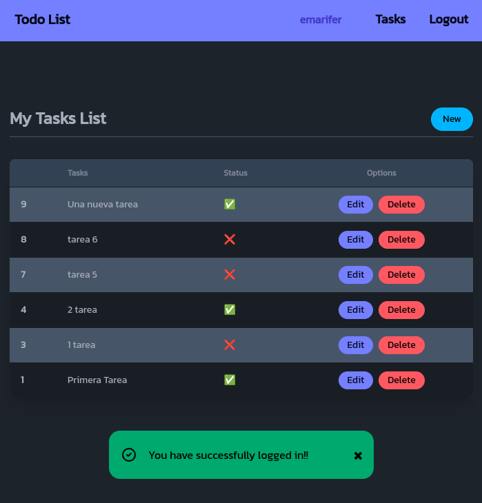
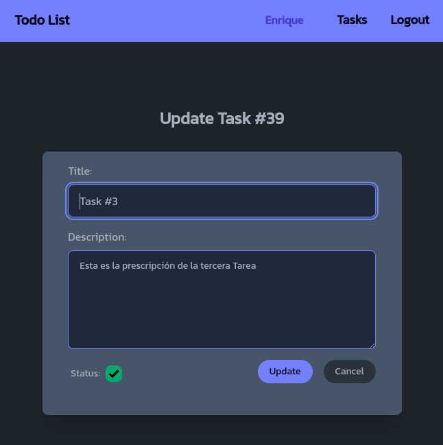
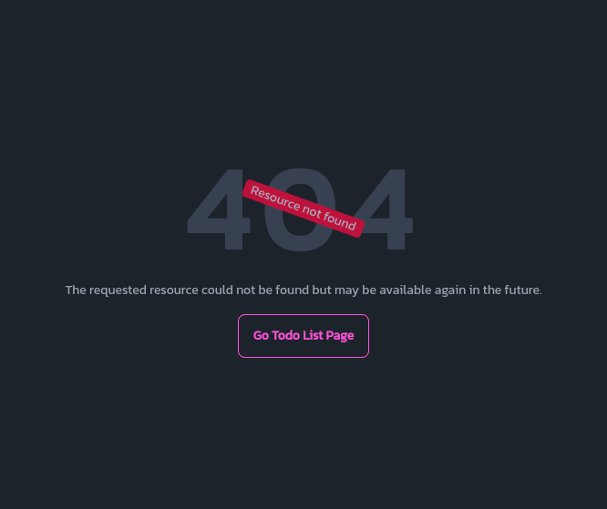

<div align="center">

# Go/Echo+<span style="color:yellow"></></span>Templ: Full stack Demo App with session authentication (with middleware) and centralized HTTP error handling with Golang's Echo framework, CRUD to a SQLite database (To Do List), use of *Templ* Template language and HTMx-powered frontend


A full stack application using Golang's Echo framework. Requests to the backend are improved in their "aesthetic" aspect with the use [</>htmx](https://htmx.org/) ([hypermedia](https://hypermedia.systems/) only).

 

</div><br />

>[!NOTE]
>***This application is an clone of this [repository](https://github.com/emarifer/rust-axum-askama-htmx-todoapp) of mine (rust-axum-askama-htmx-todoapp), but made in `Golang`.***

<hr />

### 🤔 Explanation

Demo application to use session authentication (with middleware) and centralized HTTP error handling with the Echo framework.

The architecture follows a typical "onion model" where each layer doesn't know about the layer above it, and each layer is responsible for a specific thing. Although the application is extremely simple, we use this pattern to illustrate its use in more complex applications.

Layering an application in this way can simplify code structure, since the responsibility of each type is clear.

To ensure that each part of the application is initialized with its dependencies, each struct defines a constructor (the New function in this example).



<br>

>[!IMPORTANT]
>***In this application, instead of using the [html/template](https://pkg.go.dev/html/template) package (native Golang templates), we use the [a-h/templ](https://github.com/a-h/templ) library. This amazing library implements a templating language (very similar to JSX) that compiles to Go code. `Templ` will allow us to write code almost identical to Go (with expressions, control flow, if/else, for loops, etc.) and have autocompletion thanks to strong typing. This means that errors appear at compile time and any calls to these templates (which are compiled as Go functions) from the handlers side will always require the correct data, minimizing errors and thus increasing the security and speed of our coding.***

<br>

On the other hand, we use Golang's [Echo](https://echo.labstack.com/docs) web framework, which as stated on its website is a "High performance, extensible, minimalist Go web framework".

The use of </>htmx allows behavior similar to that of a SPA, without page reloads when switching from one route to another or when making requests (via AJAX) to the backend.

The styling of the views is achieved through Tailwind CSS and DaisyUI that are obtained from their respective CDNs.

Finally, minimal use of [_hyperscript](https://hyperscript.org/) is made to achieve the action of closing the alerts when they are displayed or giving interactivity to the show/hide password button in its corresponding input.

>[!NOTE]
>***This application is very similar to several of my previous repositories ([flask-htmx-todolist](https://github.com/emarifer/flask-htmx-todolist), [gofiber-templ-htmx](https://github.com/emarifer/gofiber-templ-htmx), [go-echo-templ-project-structure](https://github.com/emarifer/go-echo-templ-project-structure), [echo-cookie-session-demo](https://github.com/emarifer/echo-cookie-session-demo)), which are developed with other frameworks (Fiber, Echo, Python's Flask framework…) and template languages (native Golang templates,  Python's Jinja2 templates or [</>Templ](https://templ.guide/) template language). This repository is a compendium of the aforementioned repositories.***

---

## 🖼️ Screenshots:

###### Todo List Page with success alert:



<br>

###### Sign Up Page with error alert:


<br>

###### Task update page:



<br>

###### Centralized HTTP error handling:



---

## 👨‍🚀 Setup:

Before compiling the view templates, you'll need to regenerate the CSS. First, you need to install the dependencies required by `Tailwind CSS` and `daisyUI` (you must have `Node.js` installed on your system) and then run the regeneration of the `main.css` file. To do this, apply the following commands:

```
$ cd tailwind && npm i
$npm run build-css-prod # `npm run watch-css` regenerate the css in watch mode for development
```

Besides the obvious prerequisite of having Go! on your machine, you must have Air installed for hot reloading when editing code.

>[!TIP]
>***In order to have autocompletion and syntax highlighting in VS Code for the `Templ templating language`, you will have to install the [templ-vscode](https://marketplace.visualstudio.com/items?itemName=a-h.templ) extension (for vim/nvim install this [plugin](https://github.com/joerdav/templ.vim)). To generate the Go code corresponding to these templates you will have to download this [executable binary](https://github.com/a-h/templ/releases/tag/v0.2.476) from Github and place it in the PATH of your system. The command:***

```
$ templ generate --watch
```

>[!TIP]
>***This command allows us to regenerate the `.templ` templates and, therefore, is necessary to start the application. This will also allow us to monitor changes to the `.templ` files and compile them as we save them if we make changes to them. Review the documentation on Templ [installation](https://templ.guide/quick-start/installation) and [support](https://templ.guide/commands-and-tools/ide-support/) for your IDE .***


Start the app in development mode:

```
$ air # Ctrl + C to stop the application
```

Build for production:

```
$ go build -ldflags="-s -w" -o ./bin/main . # ./bin/main to run the application / Ctrl + C to stop the application
```
---

### Happy coding 😀!!
